# WorldCupROI

**AI Sports Sponsorship Intelligence Platform**

WorldCupROI blends match performance, media attention, fan behavior, sponsor investment, scenario simulation, and uncertainty risk into one sponsor ROI decision platform. The goal is not only to predict football results, but to help answer: **which sponsorship strategy should a brand choose, under what risk, and why?**

[](https://github.com/2417467487-hub/WorldCupROI/actions/workflows/ci.yml)


| Link | Target |
|---|---|
| Website | [Open WorldCupROI in browser](https://2417467487-hub.github.io/WorldCupROI/) |
| Live Demo | `make dashboard` |
| Static Dashboard | [dashboard/panel_dashboard.html](dashboard/panel_dashboard.html) |
| Executive Summary | [reports/executive_summary.pdf](reports/executive_summary.pdf) |
| Business Report | [reports/business_insights.md](reports/business_insights.md) |
| Data Card | [reports/data_card.md](reports/data_card.md) |
| Model Card | [reports/model_card.md](reports/model_card.md) |
| Deployment Guide | [docs/deployment.md](docs/deployment.md) |

### Platform Hero Overview


**Core result snapshot**

| Area | Current value |
|---|---:|
| Platform health score | 100 / 100 |
| Match accuracy | 0.5566 |
| Match log loss | 0.9780 |
| Sponsor ROI MAE | 0.1177 |
| Sponsor ROI R2 | 0.8838 |
| Match conformal coverage | 0.9021 |
| ROI interval coverage | 0.8814 |
| Average Monte Carlo std | 0.1320 |

## 10-Second Overview

WorldCupROI is a reproducible sports sponsorship analytics project with four layers:

| Layer | What it does | Business value |
|---|---|---|
| Data intelligence | Separates real historical data, real text data, and proxy/mock commercial data | Makes data boundaries visible before decisions |
| ML modeling | Trains match outcome and sponsor ROI models with validation outputs | Converts sports and attention signals into measurable ROI forecasts |
| Risk and explainability | Adds SHAP-style drivers, conformal intervals, Monte Carlo risk, and scenario lift | Turns point estimates into defensible decisions |
| Decision intelligence | Adds optimization, causal evidence, counterfactuals, tail risk, temporal behavior, and graph learning | Moves from ROI prediction to sponsor portfolio decisions |
| Product dashboard | Discover -> Explain -> Predict -> Simulate -> Recommend | Makes the work usable by analysts and business reviewers |

## Results Showcase

### Model Performance Comparison

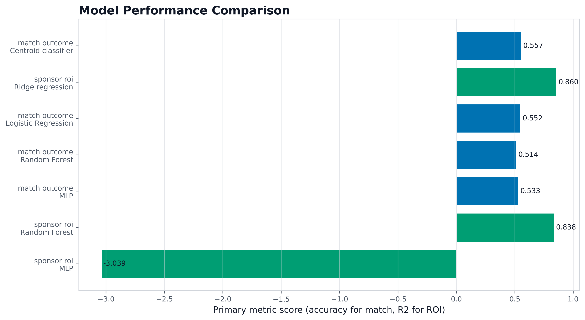

**What it shows:** Compares trained baseline and benchmark models on primary evaluation metrics.

**Why it matters:** It shows whether the current model choice is a stable baseline or only a placeholder.

**Business takeaway:** Use the benchmark spread to decide which model family deserves production tuning first.

| Task | Model | Metric | Value |
|---|---|---|---:|
| Match outcome | Centroid classifier | Accuracy | 0.5566 |
| Match outcome | Centroid classifier | Log loss | 0.9780 |
| Sponsor ROI | Ridge regression | MAE | 0.1177 |
| Sponsor ROI | Ridge regression | R2 | 0.8838 |

### ROI Feature Importance / SHAP

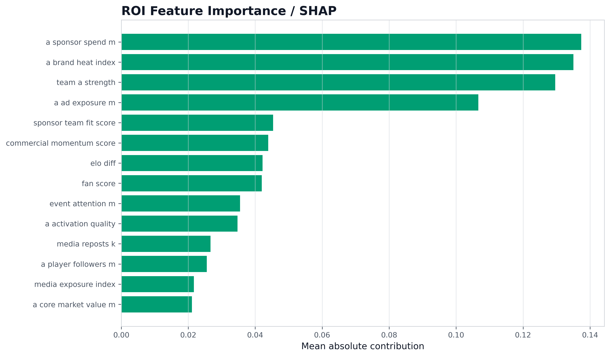

**What it shows:** Ranks the strongest sponsor ROI drivers using SHAP-style feature contribution scores.

**Why it matters:** Explainability keeps ROI recommendations auditable and helps detect proxy-label overdependence.

**Business takeaway:** Improve brand heat, sponsor-team fit, media exposure, and activation quality before scaling spend.

### Sponsor ROI Ranking

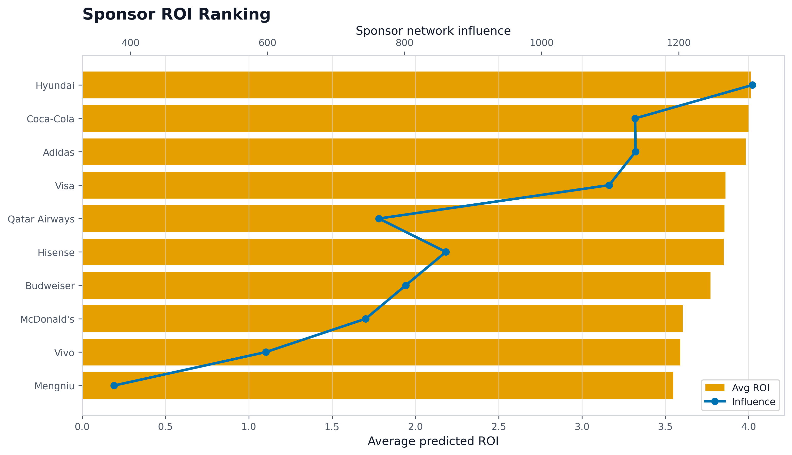

**What it shows:** Ranks sponsors by predicted commercial ROI and network influence evidence.

**Why it matters:** A sponsor can look attractive because expected ROI is high or because relationship influence is broad.

**Business takeaway:** Prioritize sponsors that combine high ROI with strong team-player-network leverage.

### Scenario ROI Lift

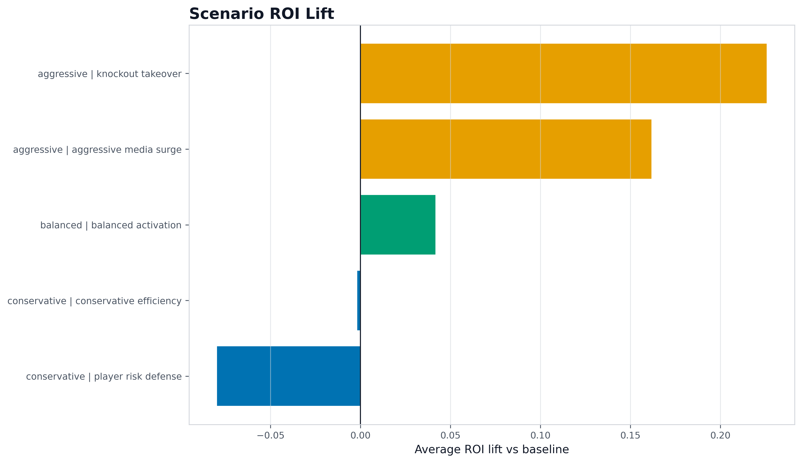

**What it shows:** Shows conservative, balanced, and aggressive strategy lift against the baseline.

**Why it matters:** Scenario analysis turns the model from prediction into a decision simulator.

**Business takeaway:** Select aggressive strategies only when lift is positive and risk remains tolerable.

### Prediction Interval / Conformal Prediction

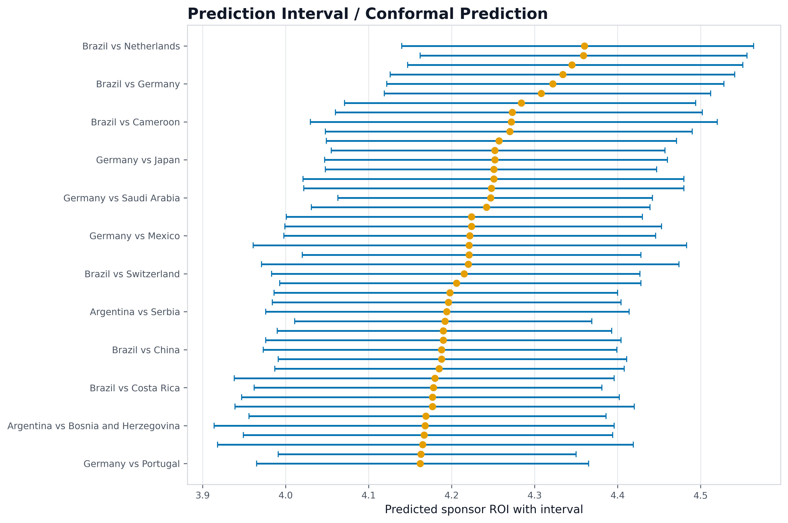

**What it shows:** Displays ROI point estimates with conformal-style prediction intervals.

**Why it matters:** Prediction intervals show forecast reliability, not just expected value.

**Business takeaway:** Prefer narrow-interval opportunities when sponsor budgets are constrained.

### Monte Carlo Risk Distribution

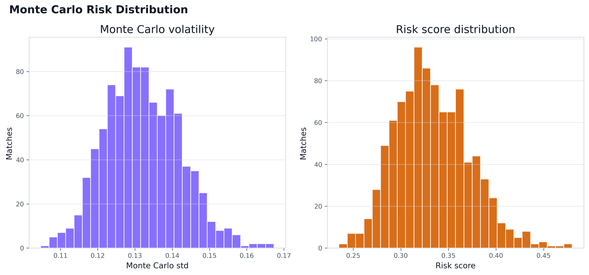

**What it shows:** Shows the distribution of Monte Carlo ROI standard deviation and risk scores.

**Why it matters:** The spread of risk is often more important than average ROI for sponsorship planning.

**Business takeaway:** Use high-risk tails as triggers for staged spend, insurance clauses, or additional analyst review.

### Sponsor-Team-Player Network

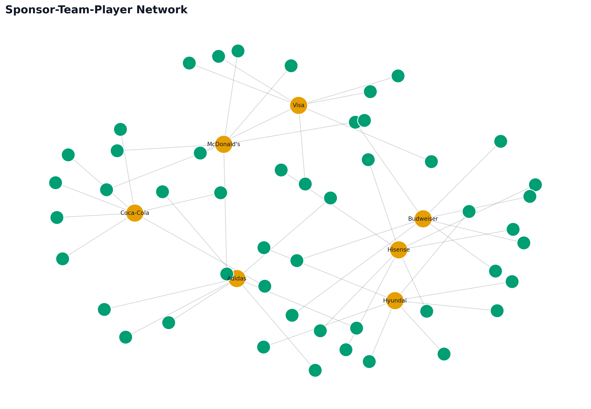

**What it shows:** Visualizes sponsor, team, and player relationships as a weighted commercial graph.

**Why it matters:** Graph position captures activation leverage that flat tables miss.

**Business takeaway:** Use central sponsors and teams as anchor partnerships for campaign portfolios.

## Decision Intelligence Showcase

### Sponsor Optimization Under Budget Constraints

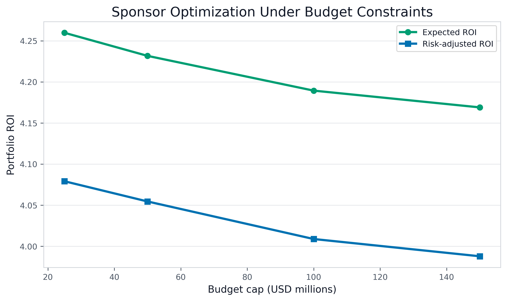

**What it shows:** Compares expected portfolio ROI and risk-adjusted ROI under different sponsorship budget caps.

**Why it matters:** The platform moves from ranking sponsors to optimizing a portfolio under budget and risk constraints.

**Business takeaway:** Use the risk-adjusted curve to decide when extra budget still creates defensible sponsor value.

### Correlation vs Causal Evidence

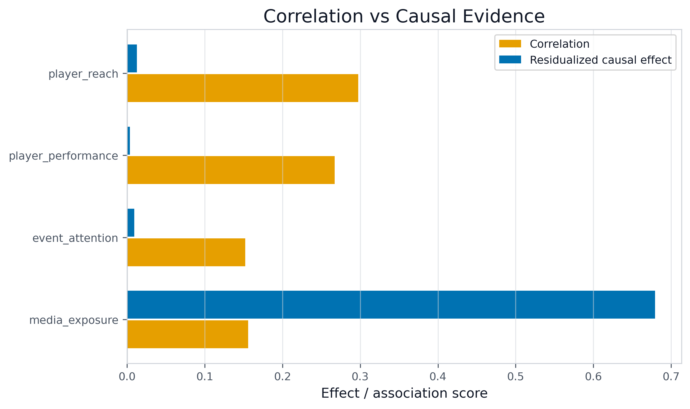

**What it shows:** Separates raw correlation from residualized causal-effect evidence for exposure, attention, and player signals.

**Why it matters:** High association does not prove causal lift; decision reviews need both views side by side.

**Business takeaway:** Treat causal evidence as a guardrail before increasing spend on media exposure or player-led campaigns.

### Fan Funnel Decay Paths

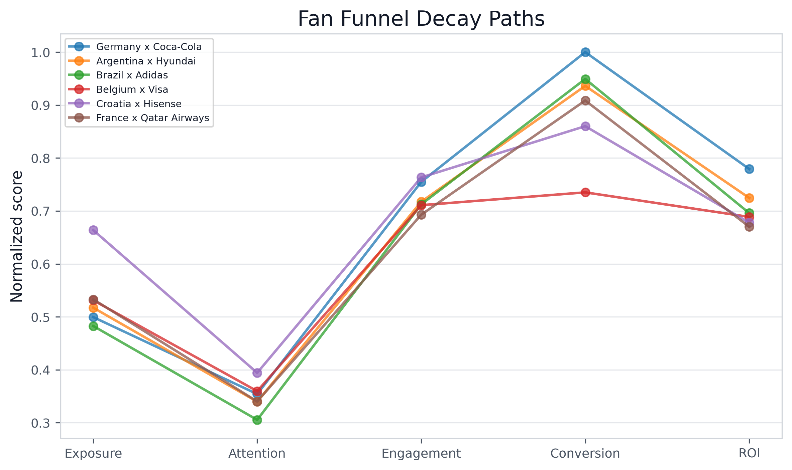

**What it shows:** Tracks Exposure -> Attention -> Engagement -> Conversion -> ROI for top sponsor-team paths.

**Why it matters:** ROI failure can happen at any funnel step, not only at the final conversion stage.

**Business takeaway:** Fix the weakest funnel transition before scaling paid media or activation budget.

### Graph Learning Future Sponsor ROI

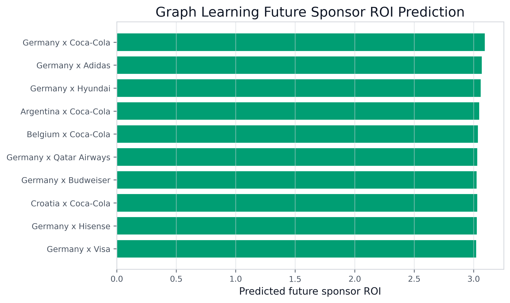

**What it shows:** Ranks future sponsor-team links using graph-learning compatible link prediction scores.

**Why it matters:** Graph learning turns relationship data into future partnership discovery.

**Business takeaway:** Use top predicted links as candidates for sponsor outreach and portfolio expansion.

### Counterfactual and Tail-Risk Decisions

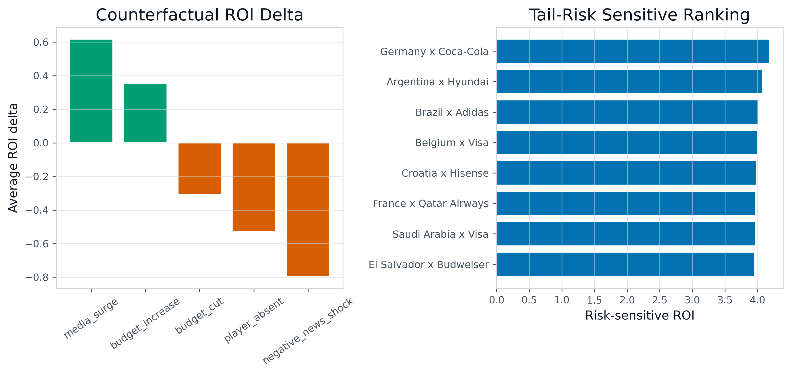

**What it shows:** Combines counterfactual ROI changes with tail-risk sensitive sponsor rankings.

**Why it matters:** Decision quality depends on downside behavior, not only average ROI.

**Business takeaway:** Prefer sponsors that remain attractive after player absence, media shock, budget change, and worst-case ROI tests.

## Problem

Most football analytics projects stop at predicting who wins. Sponsorship decisions need more: media exposure, fan attention, brand fit, player availability, commercial momentum, downside risk, and an explanation a non-technical stakeholder can trust.

WorldCupROI frames the World Cup as an attention market where sponsor ROI depends on both match context and business activation.

## Why It Matters

Tournament sponsorship budgets are committed before all outcomes are known. A high-profile campaign can underperform if the model ignores uncertainty, audience behavior, or sponsor-team fit.

| Audience | Value |
|---|---|
| Sports business analysts | Compare ROI, risk, sponsor fit, and scenario lift |
| ML reviewers | Inspect model cards, validation, feature importance, and leakage risks |
| Researchers | Study links between match performance, text signals, user attention, and ROI |
| Product reviewers | Open a dashboard and reproduce the analysis end to end |

## Key Innovations

| Innovation | Implementation |
|---|---|
| Data boundary documentation | `reports/data_card.md`, `reports/data_quality_report.md` |
| Generalization checks | K-fold, sub-sample, and temporal sliding validation in `reports/cross_validation_summary.csv` |
| User research chain | Media exposure -> user attention -> social interaction -> sponsor conversion |
| Explainable ROI modeling | SHAP-style feature contributions and grouped driver reports |
| Risk-aware decisions | Conformal intervals, bootstrap intervals, Monte Carlo risk, scenario ranking |
| Graph intelligence | NetworkX centrality plus reproducible GCN/GraphSAGE-style baseline scores |
| Decision optimization | Budget-constrained sponsor portfolio engine with Bayesian/RL-style baselines |
| Causal decision support | Residualized causal-effect estimates that separate association from decision evidence |
| Counterfactual and tail risk | SCM-compatible stress tests and worst-case ROI ranking |
| Graph learning | Link prediction for future sponsor-team ROI opportunities |
| Productized workflow | Dashboard pages: Discover -> Explain -> Predict -> Simulate -> Recommend |

## Research Questions

1. How much do match strength, player availability, and tournament stage change sponsor ROI?
2. Do media narratives and fan behavior improve ROI analysis beyond match results?
3. Which sponsor features create the strongest ROI lift under uncertainty?
4. How stable are ROI predictions under cross-validation and subsample checks?
5. Can graph centrality reveal sponsor-team-player influence patterns?
6. How can a dashboard convert model output into a business recommendation?

## Dataset & Data Sources

| Data category | Examples | Trust level | Boundary |
|---|---|---|---|
| Real historical data | International match records, World Cup history | Medium-high | Public historical sports facts |
| Real text data | GDELT/Wikimedia style article metadata and text windows | Medium | Real-source text, lightweight NLP features |
| Proxy/mock commercial data | Sponsor spend, ad exposure, activation quality, conversion proxy | Medium-low | Reproducible demo data, not audited revenue |
| Derived model outputs | Predicted ROI, risk score, scenario lift | Model-dependent | Decision support only |

Detailed documentation:

```text
reports/data_card.md
reports/data_quality_report.md
docs/data_card.md
```

## Model Performance

Validation is generated by `src/model_validation.py` and saved to `reports/cross_validation_summary.csv`. It now includes random k-fold validation, sub-sample sensitivity checks, and tournament-era temporal sliding validation.

| Validation | Task | Model | Metric | Folds | Mean | Std | Min | Max |
|---|---|---|---|---:|---:|---:|---:|---:|
| kfold | match_outcome | CentroidOutcomeModel | accuracy | 5 | 0.5436 | 0.0389 | 0.5026 | 0.6010 |
| kfold | sponsor_roi | RidgeROIModel | r2 | 5 | 0.8836 | 0.0126 | 0.8680 | 0.9026 |
| subsample_70pct | match_outcome | CentroidOutcomeModel | accuracy | 1 | 0.5552 | 0.0000 | 0.5552 | 0.5552 |
| subsample_70pct | sponsor_roi | RidgeROIModel | r2 | 1 | 0.8813 | 0.0000 | 0.8813 | 0.8813 |
| temporal_train_to_2014_test_2018 | match_outcome | CentroidOutcomeModel | accuracy | 1 | 0.6094 | 0.0000 | 0.6094 | 0.6094 |
| temporal_train_to_2018_test_2022 | sponsor_roi | RidgeROIModel | r2 | 1 | 0.8885 | 0.0000 | 0.8885 | 0.8885 |

Model governance:

```text
reports/model_card.md
reports/match_outcome_model_card.md
reports/sponsor_roi_model_card.md
```

## Explainability & SHAP

Explainability artifacts:

```text
reports/roi_feature_importance.csv
reports/roi_driver_explanations.csv
reports/explainability_report.md
assets/figures/roi_feature_importance_shap.png
```

The ROI explanation layer is designed for business review: it connects model output to sponsor spend, brand heat, media exposure, FanScore, stage premium, player influence, and sponsor-team fit.

## Uncertainty & Conformal Prediction

| Reliability layer | Output | Current value |
|---|---|---:|
| Match conformal prediction | Coverage rate | 0.9021 |
| Match conformal prediction | Average set size | 2.3814 |
| ROI conformal prediction | Coverage rate | 0.8557 |
| ROI conformal prediction | Average interval width | 0.4745 |
| Monte Carlo risk | Average std | 0.1320 |
| Monte Carlo risk | Medium-risk cases | 119 |

Risk artifacts:

```text
data/roi_uncertainty.csv
reports/conformal_prediction_report.md
reports/uncertainty_summary.md
assets/figures/monte_carlo_risk_distribution.png
assets/figures/prediction_interval_conformal.png
```

## Scenario Simulation

WorldCupROI supports conservative, balanced, and aggressive sponsor strategies. Each scenario includes ROI, lift, risk score, confidence interval, recommendation reason, and rank.

| Strategy | Intended use |
|---|---|
| Conservative | Reduce downside when uncertainty is high |
| Balanced | Default planning mode for stable sponsor activation |
| Aggressive | Capture high-attention stages when upside justifies risk |

Generated artifacts:

```text
data/scenario_recommendations.csv
reports/scenario_ranking.md
reports/scenario_strategy_summary.csv
assets/figures/scenario_roi_lift.png
```

## Graph Intelligence

The graph layer upgrades a flat sponsor table into a heterogeneous team-player-sponsor-match network.

| Graph output | File |
|---|---|
| Node centrality | `reports/graph_node_centrality.csv` |
| Sponsor influence | `reports/sponsor_influence_scores.csv` |
| Player influence | `reports/player_commercial_influence.csv` |
| GCN / GraphSAGE baseline | `reports/gnn_baseline_node_scores.csv` |
| GNN + SHAP bridge | `reports/gnn_explainability_bridge.md` |
| Graph report | `reports/graph_analysis_report.md` |
| Network figure | `assets/figures/sponsor_team_player_network.png` |

The current graph baseline uses centrality features, weighted two-hop propagation, and a GraphSAGE-style neighbor aggregation score. It is not a production neural GNN yet, but it gives reviewers a reproducible bridge from relationship structure to sponsor/player influence and SHAP-style ROI drivers.

## Architecture

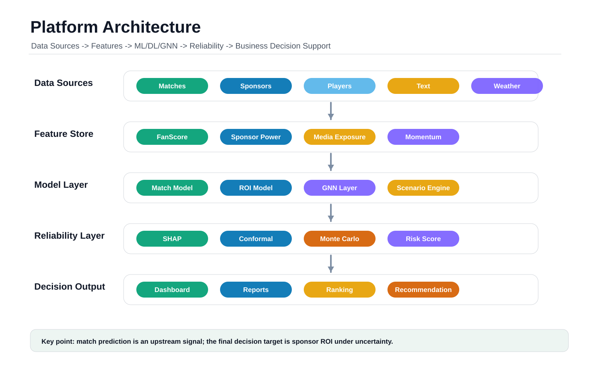

**What it shows:** The full platform architecture from data sources to features, models, risk controls, reports, and dashboard delivery.

**Why it matters:** Reviewers can understand how data, modeling, uncertainty, graph intelligence, and product outputs connect.

**Business takeaway:** Sponsors can trace a recommendation back to evidence rather than treating the dashboard as a black box.

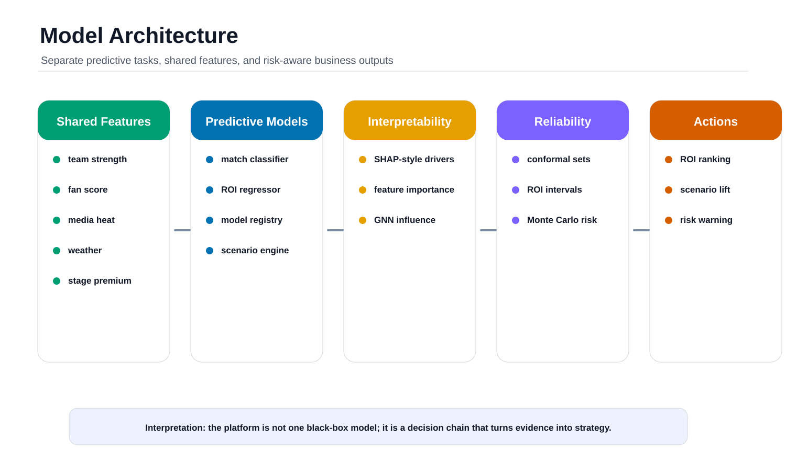

**What it shows:** The modeling pipeline for match prediction, ROI prediction, explanation, conformal intervals, and scenario outputs.

**Why it matters:** Separating match outcome modeling from sponsor ROI modeling keeps the business target clear.

**Business takeaway:** Match probability becomes one commercial input, not the final product.

## Dashboard Gallery

The Streamlit app is structured as five decision pages:

```text
Discover -> Explain -> Predict -> Simulate -> Recommend
```

| Page | Purpose | Interactive/exportable outputs |
|---|---|---|
| Discover | Select team, sponsor, stage, and year context | KPI export |
| Explain | Inspect ROI, sponsor ranking, and attention map | Chart hover and filtered tables |
| Predict | Review FanScore and prediction intervals | Risk CSV / PDF / Markdown |
| Simulate | Compare weather, venue, and stage effects | Scenario charts |
| Recommend | Compare conservative/balanced/aggressive strategies and inspect sponsor network influence | Scenario and Network CSV / PDF / Markdown |

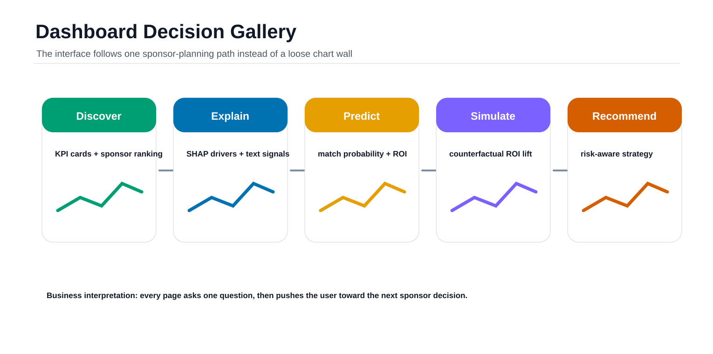

**What it shows:** The dashboard pages as a decision workflow, not a loose chart wall.

**Why it matters:** Each page answers one business question and passes the user to the next step.

**Business takeaway:** Analysts can move from evidence to recommendation without leaving the platform.

Additional GIF previews:

| Preview | GIF |
|---|---|
| Static dashboard overview |  |
| Scenario simulation |  |
| Risk analysis |  |
| Network analysis |  |

## Demo Video

The repository includes generated demo media:

```text
assets/videos/worldcuproi_demo.mp4
assets/gifs/platform_hero_overview.gif
assets/gifs/static_platform_dashboard.gif
assets/gifs/scenario_simulation.gif
assets/gifs/risk_uncertainty.gif
assets/gifs/network_graph.gif
```

The main README GIF is captured from the polished static HTML dashboard, so the GitHub preview works without a server while still reflecting the five-page World Cup styled decision workflow.

## Installation & Reproducibility

### Windows PowerShell

```powershell
git clone https://github.com/2417467487-hub/WorldCupROI.git
cd WorldCupROI
python -m venv .venv
.venv\Scripts\activate
pip install -r requirements.txt
python src/pipeline.py --demo
streamlit run dashboard/app.py -- --demo
```

### macOS

```bash
git clone https://github.com/2417467487-hub/WorldCupROI.git
cd WorldCupROI
python3 -m venv .venv
source .venv/bin/activate
pip install -r requirements.txt
python src/pipeline.py --demo
streamlit run dashboard/app.py -- --demo
```

### Linux

```bash
git clone https://github.com/2417467487-hub/WorldCupROI.git
cd WorldCupROI
python3 -m venv .venv
source .venv/bin/activate
pip install -r requirements.txt
python src/pipeline.py --demo
streamlit run dashboard/app.py -- --demo
```

### Make Shortcuts

```bash
make pipeline
make dashboard
make assets
make demo
```

### Docker

```bash
docker build -t worldcuproi .
docker run --rm -p 8501:8501 worldcuproi
```

### CI/CD

```text
.github/workflows/ci.yml
.github/workflows/streamlit-cloud.yml
docs/deployment.md
```

The Streamlit Cloud workflow runs the demo pipeline, smoke-tests the Streamlit app, and optionally calls `STREAMLIT_DEPLOY_HOOK_URL` when configured.

## Contributions

| Contribution type | What this project contributes |
|---|---|
| Academic | Data card, model card, k-fold/sub-sample/temporal validation, uncertainty quantification, GNN baseline |
| Engineering | Reproducible pipeline, Makefile, Dockerfile, CI/CD, dashboard, generated assets |
| Business | Sponsor ROI ranking, strategy templates, risk-aware recommendations, user research funnel |

## Roadmap

| Phase | Product goal |
|---|---|
| v1 Portfolio platform | Stable demo mode, generated reports, dashboard, README showcase |
| v2 Data upgrade | Replace proxy commercial data with licensed sponsor CRM, broadcast, social, and sales data |
| v3 Model upgrade | Calibrated boosted models, uplift modeling, drift monitoring, stronger temporal feature stores |
| v4 Graph AI | Production GraphSAGE/GCN training with licensed conversion labels, temporal graph influence, sponsor portfolio optimization |
| v5 Deployment | Hosted Streamlit Cloud demo, GitHub Pages static site, automated release artifacts |

## License / Contact

This repository is a portfolio and research demonstration project. Commercial sponsor variables are documented as proxy/mock where audited campaign data is unavailable.

Repository: [github.com/2417467487-hub/WorldCupROI](https://github.com/2417467487-hub/WorldCupROI)
