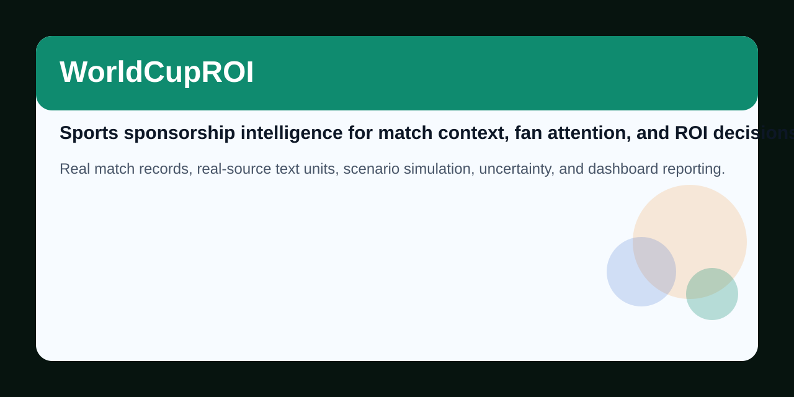
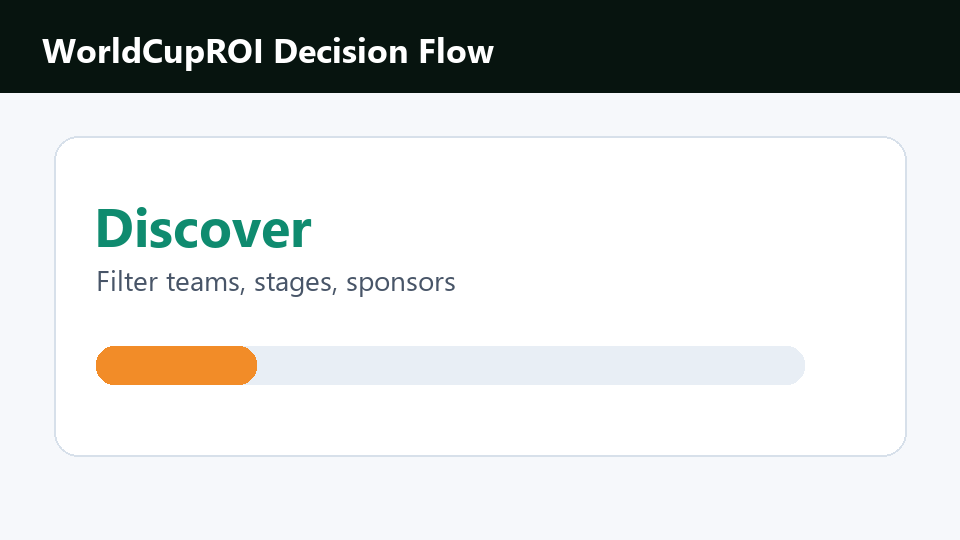
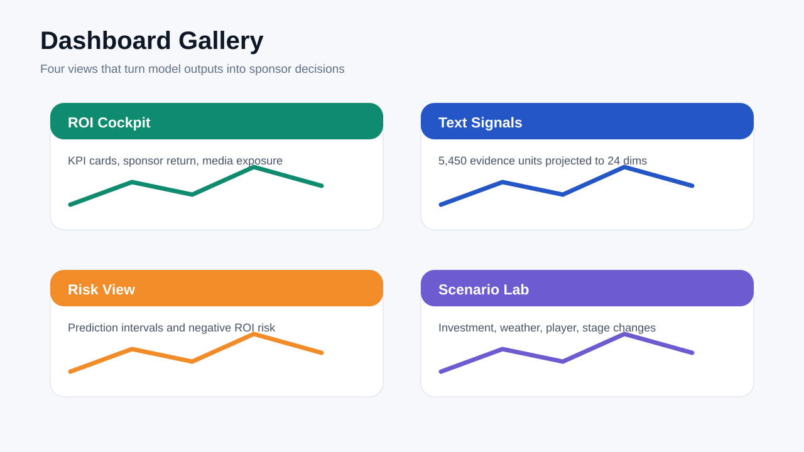
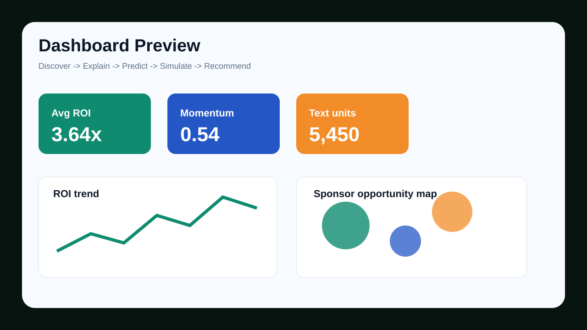
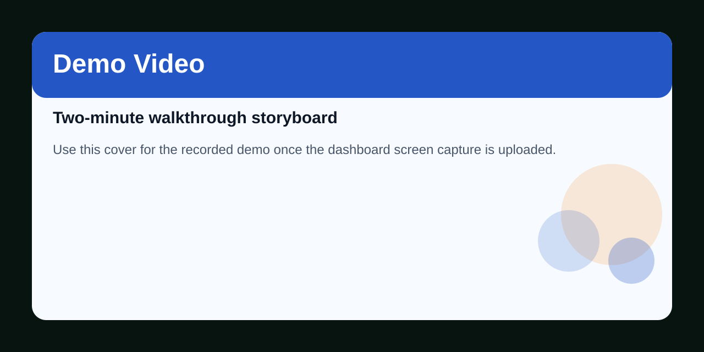

# WorldCupROI



**AI Sports Sponsorship Intelligence Platform for World Cup sponsorship ROI, fan attention, media narratives, uncertainty, and scenario-based business decisions.**

[](https://github.com/2417467487-hub/WorldCupROI/actions/workflows/ci.yml)


WorldCupROI turns FIFA World Cup data into a sponsorship decision platform. It combines real match records, real-source text evidence, sponsor signals, ROI modeling, prediction intervals, and scenario simulation into a dashboard that helps answer one business question:

> Which sponsorship strategy is worth funding, and what risk does that decision carry?

中文概览：WorldCupROI 将世界杯比赛、真实文本、赞助曝光、粉丝影响力和 ROI 风险建模整合为体育赞助商业智能平台。

## 10-Second Overview

| What it does | Why it matters |
|---|---|
| Predicts sponsor ROI | Moves beyond match prediction into commercial decision support |
| Uses real-source text | Adds media narratives and sponsor news context instead of only tabular data |
| Quantifies risk | Shows ROI intervals, variance, and negative ROI probability |
| Simulates strategies | Compares sponsor spend, media exposure, player availability, weather, and stage changes |
| Ships a dashboard | Organizes analysis into Discover -> Explain -> Predict -> Simulate -> Recommend |

[](dashboard/panel_dashboard.html)

## Problem

Sports sponsorship is expensive, time-sensitive, and hard to evaluate. A brand may invest before the event, but the return depends on shifting conditions:

- match importance and tournament stage
- team strength and player availability
- fan attention and media reposts
- sponsor spend, ad exposure, brand heat, and brand fit
- weather, venue, and home/away context
- news narratives and public sentiment

Most sports analytics projects stop at predicting who wins. WorldCupROI treats match probability as only one input. The central output is sponsor ROI, risk, and recommended action.

## Why It Matters

Major tournaments create a compressed attention market. Sponsors need to make decisions before all information is known, and poor timing can turn a high-profile campaign into low return.

WorldCupROI is designed for three audiences:

| Audience | Value |
|---|---|
| Sports business analysts | compare sponsors, teams, stages, and ROI risk |
| ML and data science reviewers | inspect reproducible modeling, feature engineering, and uncertainty outputs |
| Researchers | study how sports performance, media attention, sentiment, and sponsorship signals interact |

The goal is not to make a decorative dashboard. The goal is to connect predictions to a business decision.

## Innovations


| Innovation | Implementation |
|---|---|
| Multi-source data system | World Cup match records, GDELT article metadata, Wikimedia text, sponsor tables, weather context |
| Multimodal text layer | 5,450 real-source text units -> hashed TF-IDF -> 24-dimensional reduced text features |
| Sponsorship feature store | FanScore, Sponsor Power Index, Media Exposure Index, Commercial Momentum Score |
| Model stack | match outcome classification, sponsor ROI regression, scenario simulation |
| Uncertainty quantification | ROI intervals, variance proxy, negative ROI probability, risk score |
| Research roadmap | GNN graph modeling, conformal prediction, generated business reports, sponsor network analysis |
| Product workflow | Discover -> Explain -> Predict -> Simulate -> Recommend |

## Architecture


```text
real match records
real-source text signals
sponsor and media features
weather and stage context
        |
        v
feature engineering
        |
        v
match probability + sponsor ROI models
        |
        v
uncertainty + scenario engines
        |
        v
dashboard + reports + recommendations
```

## Research Questions

1. How much do match probability, team strength, and player availability affect sponsor ROI?
2. Do sponsor spend and ad exposure matter more than fan attention and media narratives?
3. Can real-source text signals improve commercial momentum analysis?
4. Which scenarios create the strongest ROI lift under risk constraints?
5. How can uncertainty intervals make sponsor decisions more defensible?
6. What role could graph models play in team-player-sponsor-match relationships?

## Model Visuals

| Model explanation | Visual |
|---|---|
| ROI drivers |  |
| Prediction intervals |  |
| Text signal projection |  |
| Strategy ranking |  |

## Results

| Output | Current value |
|---|---:|
| Historical World Cup matches | 964 |
| 2026 schedule rows | 72 |
| Real-source text units | 5,450 |
| Reduced text dimensions | 24 |
| Dashboard panel rows | 1,928 |
| Match model accuracy | 0.5566 |
| Match model log loss | 0.9780 |
| ROI model MAE | 0.1177 |
| ROI model R2 | 0.8687 |

Top ROI drivers in the current model include brand heat, team strength, sponsor spend, ad exposure, sponsor-team fit, commercial momentum, Elo difference, and FanScore.

## Dashboard





The dashboard is structured around a business decision sequence rather than a loose chart collection.


| Step | Decision question |
|---|---|
| Discover | Which teams, sponsors, stages, and years are being compared? |
| Explain | Which features drive ROI and attention? |
| Predict | What are the expected match and sponsorship outcomes? |
| Simulate | How does ROI shift under sponsor, player, weather, and stage changes? |
| Recommend | Which scenario has the best lift-risk tradeoff? |

Open the static dashboard:

```text
dashboard/panel_dashboard.html
```

Run the Streamlit dashboard:

```bash
streamlit run dashboard/app.py
```

## Contributions

### Academic Contribution

- Frames sponsorship ROI as a multi-signal modeling problem rather than a post-event descriptive metric.
- Combines sports analytics, media text signals, business features, and uncertainty analysis.
- Provides a reproducible research scaffold for studying fan attention, sponsor exposure, and commercial return.
- Documents future extensions for GNN sponsor networks, conformal prediction, SHAP explanations, and generated business reports.

### Industry Value

- Helps compare sponsorship strategies before or during tournament windows.
- Gives executives risk-aware ROI estimates rather than only point predictions.
- Supports scenario planning for media exposure, player availability, weather, and stage premium.
- Produces dashboard-ready outputs for analyst workflow and portfolio presentation.

### Engineering Value

- One-command pipeline script.
- Dockerfile for containerized execution.
- GitHub Actions workflow for CI validation.
- SQL schema and Java rule example for cross-stack extensibility.
- Reproducible data, reports, dashboard HTML, and generated visual assets.

## Data

| Dataset | Role |
|---|---|
| `data/raw/international_results.csv` | public international match records used to derive World Cup match history |
| `data/raw/gdelt_worldcup_articles_deduped.json` | GDELT article metadata related to World Cup sponsorship and media |
| `data/raw/wikipedia_pages.json` | Wikimedia page text for tournament, marketing, and sponsor context |
| `data/real_text_articles.csv` | 5,450 real-source text units and evidence windows |
| `data/text_embeddings_reduced.csv` | 24-dimensional reduced text features |
| `data/modeling_dataset.csv` | joined modeling table |
| `data/panel_dataset.csv` | dashboard-ready panel data |

Commercial metrics such as exact sponsor spend are proxy-derived where public contract-level data is unavailable. These columns are documented so they can be replaced by licensed commercial datasets.

## Installation

```bash
git clone https://github.com/2417467487-hub/WorldCupROI.git
cd WorldCupROI
python -m venv .venv
.venv\Scripts\activate
pip install -r requirements.txt
```

macOS/Linux activation:

```bash
source .venv/bin/activate
```

## One-Command Pipeline

```bash
python scripts/run_pipeline.py
```

Makefile shortcuts:

```bash
make pipeline
make dashboard
make assets
```

Manual pipeline:

```bash
python src/real_data_ingestion.py
python src/text_dimensionality.py
python src/feature_builder.py
python src/advanced_features.py
python src/data_quality.py
python src/train_match_model.py
python src/train_roi_model.py
python src/uncertainty.py
python src/scenario_engine.py
python src/build_panel_data.py
python src/build_plotly_dashboard.py
```

Docker:

```bash
docker build -t worldcuproi .
docker run --rm -p 8501:8501 worldcuproi
```

## Project Map

```text
WorldCupROI/
|-- data/                  # raw sources, modeling tables, dashboard panels
|-- dashboard/             # Streamlit app and static Plotly dashboard
|-- docs/
|   |-- assets/            # README visuals, GIFs, model diagrams
|   |-- dataset_card.md
|   |-- data_system.md
|   |-- feature_dictionary.md
|   |-- ml_framework.md
|   |-- model_registry.md
|   `-- research_agenda.md
|-- notebooks/             # EDA, modeling, scenario simulation
|-- reports/               # metrics, uncertainty, scenario summaries
|-- scripts/               # pipeline and README visual generators
|-- src/                   # data, modeling, uncertainty, dashboard builders
|-- sql/                   # database schema
|-- java/                  # sponsor risk rule example
|-- Dockerfile
|-- Makefile
`-- README.md
```

## Roadmap

| Stage | Planned upgrade |
|---|---|
| Data connectors | Open-Meteo/Meteostat weather, sponsor contract datasets, social platform APIs |
| Model explainability | SHAP dashboards, partial dependence, calibrated probability plots |
| Risk modeling | conformal coverage reports, bootstrap intervals, ensemble variance tracking |
| Graph intelligence | Team-player-sponsor-match graph with GraphSAGE or GCN baseline |
| Generated analysis | automatic executive sponsor reports from metrics, SHAP, and scenarios |
| Product experience | downloadable PDF reports, dashboard export, hosted demo video |

## Demo

[](docs/demo_video.md)

A 2-3 minute demo storyboard is available in [docs/demo_video.md](docs/demo_video.md). After recording, replace the storyboard with a GitHub Release, YouTube, or Loom link.
