# WorldCupROI

**AI Sports Sponsorship Intelligence Platform**

WorldCupROI is not a simple World Cup match-result predictor. It combines match performance, media narratives, fan influence, sponsor investment, and uncertainty risk into a sponsor ROI decision platform.

[](https://github.com/2417467487-hub/WorldCupROI/actions/workflows/ci.yml)


[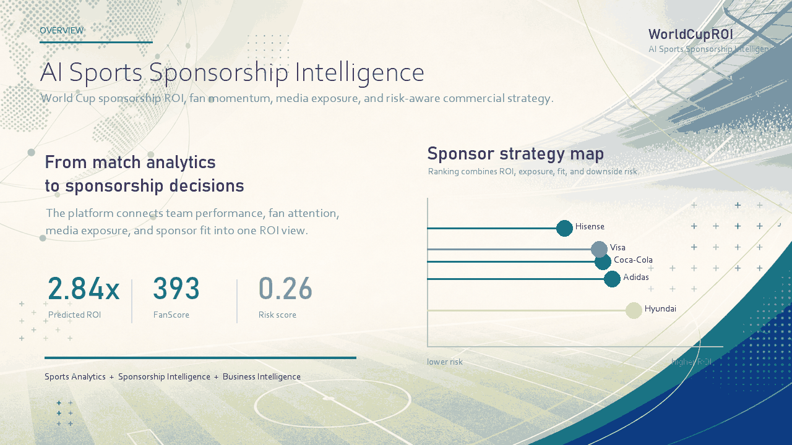](dashboard/panel_dashboard.html)

| Link | Target |
|---|---|
| Live Demo | `streamlit run dashboard/app.py` |
| Static Demo | [dashboard/panel_dashboard.html](dashboard/panel_dashboard.html) |
| Demo Video | [assets/videos/worldcuproi_demo.mp4](assets/videos/worldcuproi_demo.mp4) |
| Report | [sample_report.pdf](sample_report.pdf) |
| Research Brief | [reports/sponsorship_intelligence_brief.md](reports/sponsorship_intelligence_brief.md) |

| Key result | Current value |
|---|---:|
| Match prediction accuracy | 0.5566 |
| Match prediction log loss | 0.9780 |
| Sponsor ROI model MAE | 0.1177 |
| Sponsor ROI model R2 | 0.8687 |
| Match conformal coverage | 0.9021 |
| ROI interval coverage | 0.8814 |
| Average negative ROI probability | 0.0000 |

中文概览：WorldCupROI 不是单纯预测世界杯胜负，而是将比赛表现、真实文本、赞助曝光、粉丝影响力和 ROI 风险建模整合为体育赞助商业智能平台。

## 10-Second Overview

| What it does | Why it matters |
|---|---|
| Predicts sponsor ROI | Moves beyond match prediction into commercial decision support. |
| Uses real-source text | Adds media narratives and sponsor news context beyond tabular sports data. |
| Quantifies uncertainty | Reports ROI intervals, coverage, variance, and negative ROI probability. |
| Simulates strategies | Tests sponsor spend, media exposure, player availability, weather, and tournament stage changes. |
| Ships a dashboard | Organizes decisions through Discover -> Explain -> Predict -> Simulate -> Recommend. |

## Results Showcase

The project presents results before implementation details so that sponsors, analysts, and reviewers can quickly see what the platform produces.

### Results Overview

| Area | Output | Current value | Decision meaning |
|---|---|---:|---|
| Match prediction | Accuracy | 0.5566 | Baseline signal for team outcome probability. |
| Match prediction | Log loss | 0.9780 | Measures probability calibration quality. |
| Sponsor ROI | MAE | 0.1177 | Average ROI prediction error. |
| Sponsor ROI | R2 | 0.8687 | Share of ROI variance explained by model signals. |
| Conformal prediction | Match coverage | 0.9021 | Reliability of match prediction sets. |
| Conformal prediction | ROI coverage | 0.8814 | Reliability of ROI interval estimates. |
| Uncertainty | Negative ROI probability | 0.0000 | Current average downside probability in generated panel. |

### Model Performance Comparison

| Task | Model | Primary metric | Score | Secondary metric | Secondary score | Notes |
|---|---|---|---:|---|---:|---|
| Match outcome | Centroid classifier | Accuracy | 0.5566 | Log loss | 0.9780 | Dependency-free baseline. |
| Sponsor ROI | Ridge regression | R2 | 0.8687 | MAE | 0.1177 | Dependency-free baseline. |
| Tabular modeling | XGBoost | Optional | N/A | N/A | N/A | Enable by installing `xgboost`. |
| Tabular modeling | LightGBM | Optional | N/A | N/A | N/A | Enable by installing `lightgbm`. |
| Categorical modeling | CatBoost | Optional | N/A | N/A | N/A | Enable by installing `catboost`. |

### ROI Feature Importance / SHAP

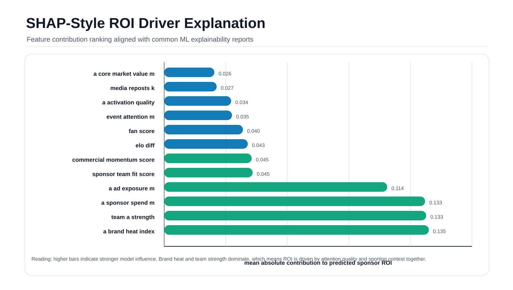

What it shows: Figure 1 ranks the strongest drivers of predicted sponsor ROI, including brand heat, team strength, sponsor spend, ad exposure, sponsor-team fit, and commercial momentum.

Why it matters: Sponsor value is driven by both football performance and attention dynamics, so ROI cannot be explained by match results alone.

Business takeaway: Brands should evaluate team strength together with media exposure, fan attention, and sponsor-team fit before increasing campaign spend.

### Sponsor ROI Ranking

| Rank | Sponsor | Influence score | Connected nodes | Average edge weight |
|---:|---|---:|---:|---:|
| 1 | Hyundai | 1261.417 | 262 | 2.3534 |
| 2 | Adidas | 1079.883 | 233 | 2.3074 |
| 3 | Coca-Cola | 1046.330 | 235 | 2.2262 |
| 4 | Visa | 1030.583 | 236 | 2.2021 |
| 5 | Hisense | 787.907 | 185 | 2.1411 |

What it shows: The sponsor ranking summarizes commercial network influence across team, player, sponsor, and match relationships.

Why it matters: Sponsors with broader and stronger network positions are more likely to convert event attention into measurable commercial value.

Business takeaway: Sponsorship planning should prioritize both spend level and network fit, not only brand size.

### Scenario ROI Lift

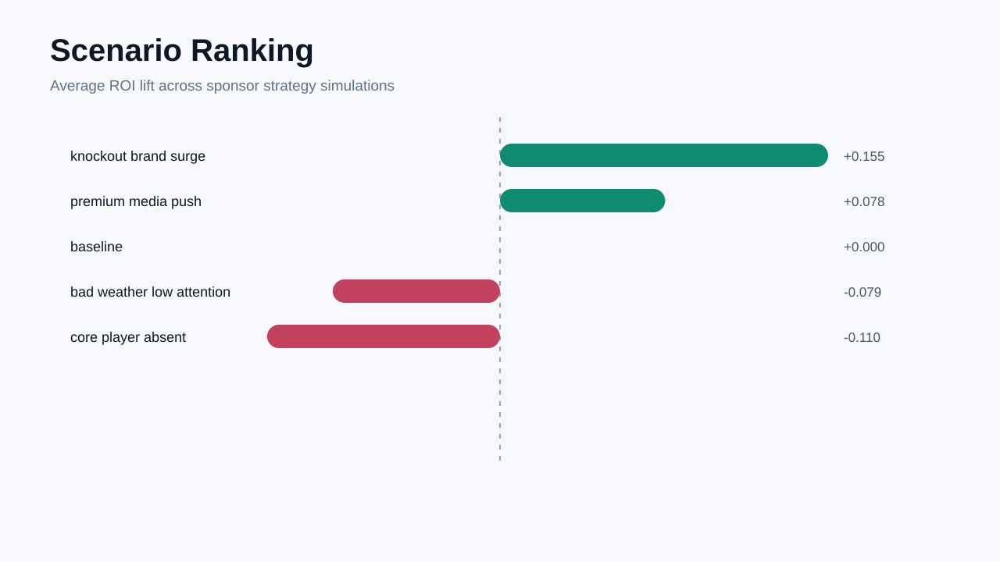

| Scenario | Average predicted ROI | Average ROI delta | Average ROI lift |
|---|---:|---:|---:|
| A_baseline | 3.850 | 0.000 | 0.000% |
| B_core_player_absent | 3.761 | -0.089 | -2.296% |
| C_sponsor_upgrade | 3.613 | -0.238 | -6.206% |
| D_media_cooling | 3.643 | -0.207 | -5.396% |

What it shows: Figure 2 compares baseline ROI with counterfactual scenarios such as player absence, sponsor activation change, and media cooling.

Why it matters: Sponsorship ROI is sensitive to player availability and attention shocks.

Business takeaway: Scenario planning should be part of sponsor budget allocation before tournament exposure peaks.

### Prediction Interval / Conformal Prediction

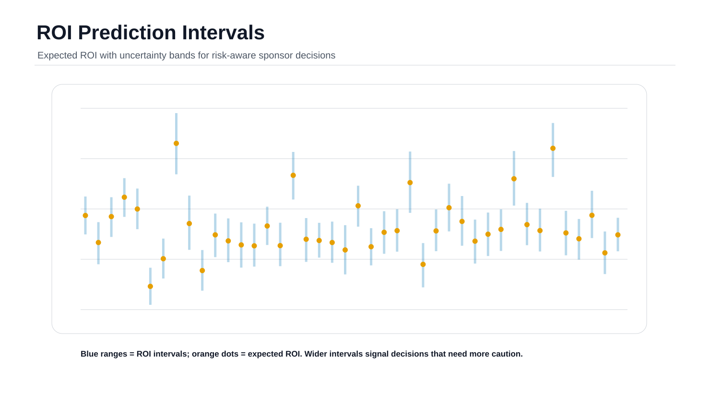

| Prediction target | Coverage rate | Average interval or set size | qhat |
|---|---:|---:|---:|
| Match prediction sets | 0.9021 | 2.3814 | 0.8110 |
| ROI prediction intervals | 0.8814 | 0.4708 | 0.2354 |

What it shows: Figure 3 shows prediction intervals and conformal coverage for match outcomes and ROI estimates.

Why it matters: Decision makers need ranges and reliability estimates, not only point predictions.

Business takeaway: Sponsors can use interval width and coverage as risk controls before approving higher spend.

### Monte Carlo Risk Distribution

| Risk metric | Current value |
|---|---:|
| Average negative ROI probability | 0.0000 |
| Average interval width | 0.4340 |
| Average Monte Carlo standard deviation | 0.1320 |
| Medium-risk cases | 119 |
| High-risk cases | 0 |

What it shows: The risk summary combines bootstrap intervals, Monte Carlo perturbation, and variance-based risk scoring.

Why it matters: ROI forecasts are more useful when the downside distribution is visible.

Business takeaway: Sponsors should compare expected ROI with risk score and interval width before selecting a campaign scenario.

### Text Signal Projection

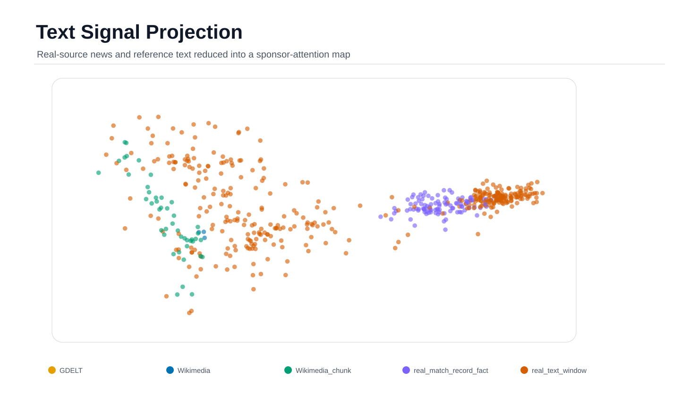

What it shows: Figure 4 projects real-source text signals from GDELT and Wikimedia into reduced dimensions for modeling.

Why it matters: Media narratives and sponsor news can change commercial momentum before the match result is known.

Business takeaway: Text evidence should be treated as an early signal for sponsor attention and campaign timing.

### Sponsor-Team-Player Network

| Network output | Current value |
|---|---:|
| Graph edges | 6112 |
| Graph nodes | 1394 |
| Top sponsor by influence | Hyundai |
| Top sponsor influence score | 1261.417 |

What it shows: The graph layer connects teams, players, sponsors, and matches into a weighted commercial network.

Why it matters: Sponsorship effectiveness depends on relationships among brands, teams, players, and event attention.

Business takeaway: Network centrality can help identify sponsors with stronger activation leverage.

## Problem

Sports sponsorship is expensive, time-sensitive, and hard to evaluate. A brand may invest before the event, but the return depends on shifting conditions:

- Match importance and tournament stage.
- Team strength and player availability.
- Fan attention and media reposts.
- Sponsor spend, ad exposure, brand heat, and brand fit.
- Weather, venue, and home/away context.
- News narratives and public sentiment.

Most sports analytics projects stop at predicting who wins. WorldCupROI treats match probability as one input into a broader sponsor ROI, risk, and recommendation system.

## Why It Matters

Major tournaments create a compressed attention market. Sponsors need to make decisions before all information is known, and poor timing can turn a high-profile campaign into low return.

| Audience | Value |
|---|---|
| Sports business analysts | Compare sponsors, teams, stages, and ROI risk. |
| ML and data science reviewers | Inspect reproducible modeling, feature engineering, and uncertainty outputs. |
| Researchers | Study how sports performance, media attention, sentiment, and sponsorship signals interact. |

The goal is to connect predictions to business decisions, not to build a decorative dashboard.

## Key Innovations

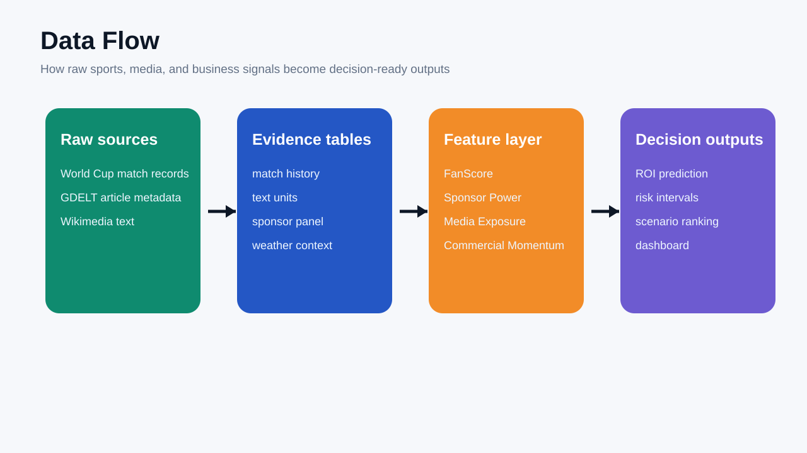

| Innovation | Implementation |
|---|---|
| Multi-source data system | World Cup match records, GDELT article metadata, Wikimedia text, sponsor tables, and weather context. |
| Multimodal text layer | 5,450 real-source text units -> hashed TF-IDF -> 24-dimensional reduced text features. |
| Sponsorship feature store | FanScore, Sponsor Power Index, Media Exposure Index, and Commercial Momentum Score. |
| Model stack | Match outcome classification, sponsor ROI regression, scenario simulation, and model registry. |
| Explainability | SHAP-style contribution tables and ROI driver reports. |
| Uncertainty quantification | Conformal prediction, bootstrap intervals, Monte Carlo risk, negative ROI probability, and risk score. |
| Graph intelligence | Team-player-sponsor-match graph with sponsor and player commercial influence scores. |
| Product workflow | Discover -> Explain -> Predict -> Simulate -> Recommend. |

## Research Questions

1. How much do match probability, team strength, and player availability affect sponsor ROI?
2. Do sponsor spend and ad exposure matter more than fan attention and media narratives?
3. Can real-source text signals improve commercial momentum analysis?
4. Which scenarios create the strongest ROI lift under risk constraints?
5. How can uncertainty intervals make sponsor decisions more defensible?
6. What role can graph models play in team-player-sponsor-match relationships?

## Dataset & Data Sources

| Dataset | Role | Boundary |
|---|---|---|
| `data/raw/international_results.csv` | Public international match records used to derive World Cup match history. | Historical public data. |
| `data/raw/gdelt_worldcup_articles_deduped.json` | GDELT article metadata related to World Cup sponsorship and media. | Real-source text metadata. |
| `data/raw/wikipedia_pages.json` | Wikimedia page text for tournament, marketing, and sponsor context. | Real-source reference text. |
| `data/real_text_articles.csv` | 5,450 real-source text units and evidence windows. | Real-source text layer. |
| `data/text_embeddings_reduced.csv` | 24-dimensional reduced text features. | Reproducible derived features. |
| `data/modeling_dataset.csv` | Joined modeling table. | Feature-engineered analysis data. |
| `data/panel_dataset.csv` | Dashboard-ready panel data. | Dashboard and reporting layer. |
| Sponsor spend and ROI fields | Commercial sponsor inputs and ROI targets. | Proxy/mock values where contract-level data is unavailable. |

Commercial metrics such as exact sponsor spend are proxy-derived where public contract-level data is unavailable. These columns are documented so they can be replaced by licensed sponsor datasets or future API connectors.

## Architecture


What it shows: Figure 5 summarizes the platform architecture from data sources to features, models, uncertainty, report generation, and dashboard delivery.

Why it matters: The system is designed as a reproducible analytics platform rather than a one-off notebook.

Business takeaway: Sponsors can trace a recommendation back to data, features, models, and risk logic.

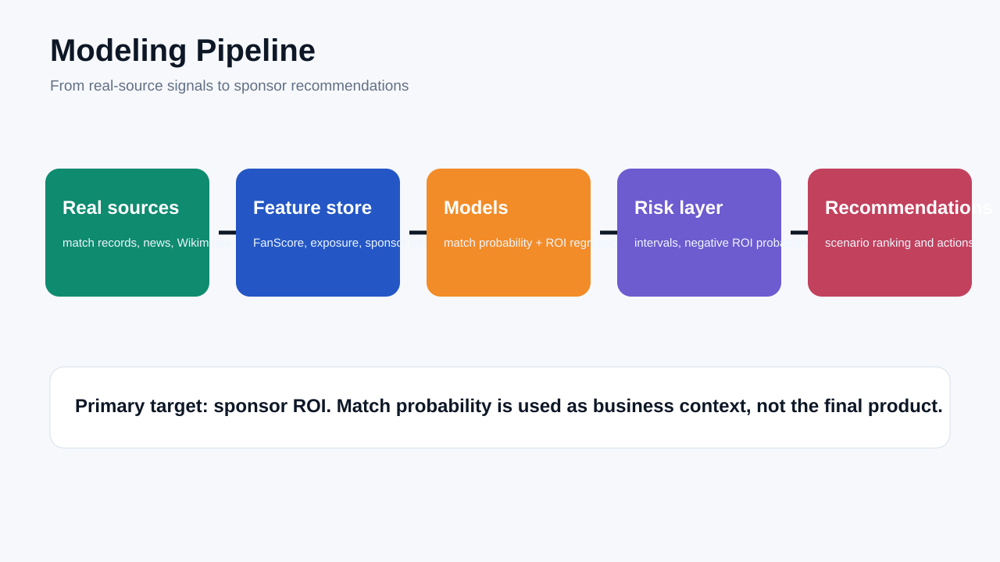

What it shows: Figure 6 shows the modeling pipeline for match prediction, ROI prediction, uncertainty, and scenario analysis.

Why it matters: Separating match outcome modeling from sponsor ROI modeling keeps the business target clear.

Business takeaway: Match probability becomes one commercial input rather than the final product.

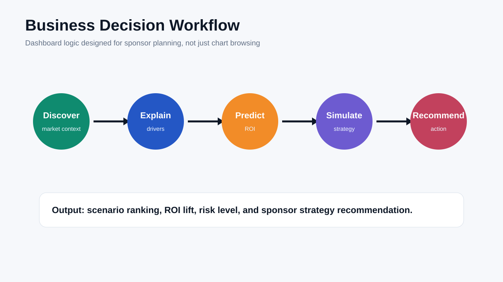

What it shows: Figure 7 maps dashboard use to the business workflow Discover -> Explain -> Predict -> Simulate -> Recommend.

Why it matters: Each module answers a decision question instead of presenting disconnected charts.

Business takeaway: The dashboard supports repeated sponsor planning, not only static reporting.

## Dashboard Gallery

The dashboard is structured around a business decision sequence rather than a loose chart collection.

| Module | Preview |
|---|---|
| Dashboard overview |  |
| Scenario simulation | 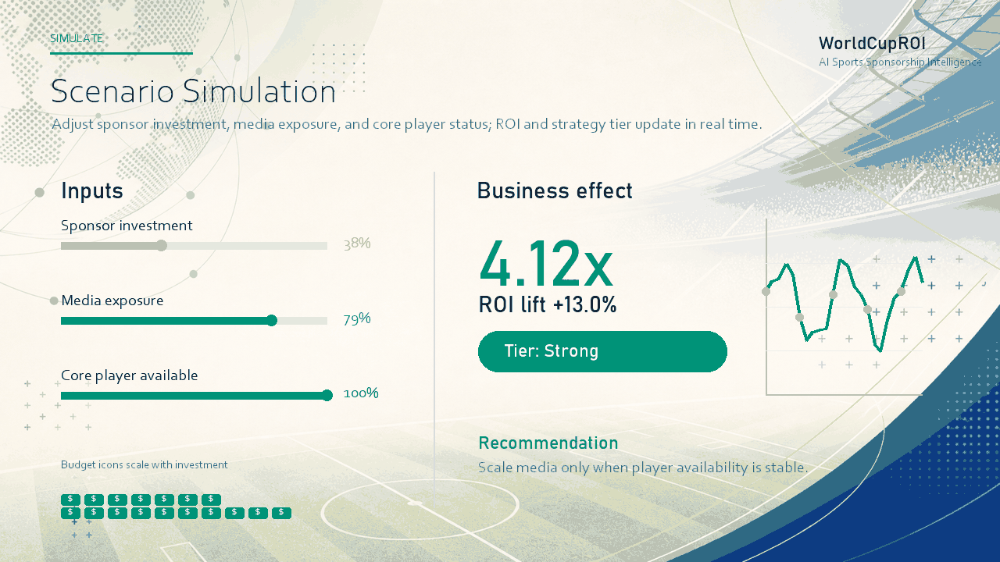 |
| Risk analysis | 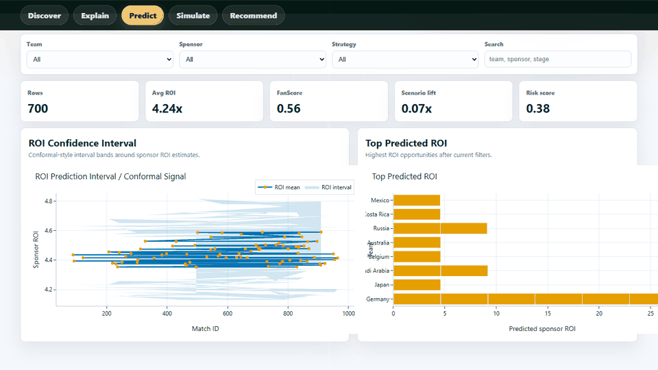 |
| Network analysis | 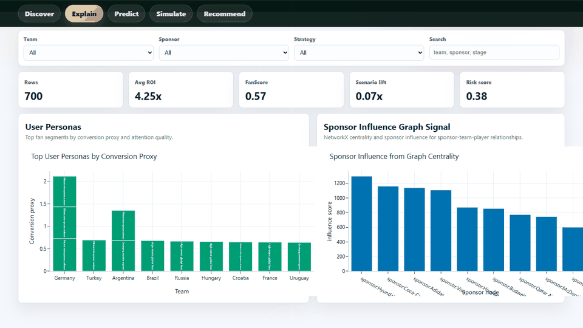 |

Demo video:

[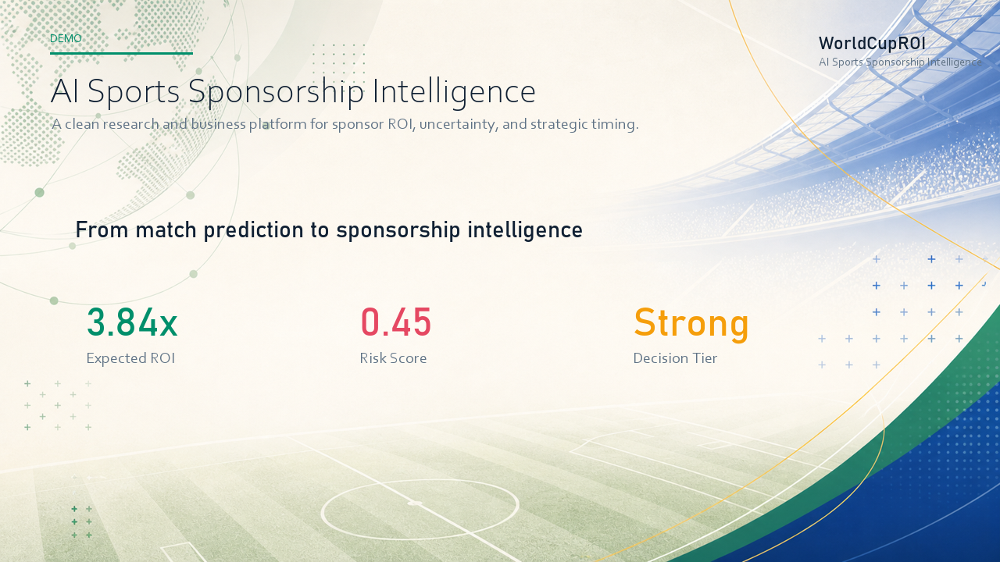](assets/videos/worldcuproi_demo.mp4)

| Step | Decision question |
|---|---|
| Discover | Which teams, sponsors, stages, and years are being compared? |
| Explain | Which features drive ROI and attention? |
| Predict | What are the expected match and sponsorship outcomes? |
| Simulate | How does ROI shift under sponsor, player, weather, and stage changes? |
| Recommend | Which scenario has the best lift-risk tradeoff? |

Static dashboard:

```text
dashboard/panel_dashboard.html
```

Streamlit dashboard:

```bash
streamlit run dashboard/app.py
```

## Installation

Clone the repository:

```bash
git clone https://github.com/2417467487-hub/WorldCupROI.git
cd WorldCupROI
python -m venv .venv
```

Windows PowerShell:

```powershell
.venv\\Scripts\\activate
pip install -r requirements.txt
python scripts/run_pipeline.py
```

macOS:

```bash
source .venv/bin/activate
pip install -r requirements.txt
python scripts/run_pipeline.py
```

Linux:

```bash
source .venv/bin/activate
pip install -r requirements.txt
python scripts/run_pipeline.py
```

Direct pipeline entrypoint:

```bash
python src/pipeline.py
```

Makefile shortcuts:

```bash
make pipeline
make dashboard
make assets
```

Docker:

```bash
docker build -t worldcuproi .
docker run --rm -p 8501:8501 worldcuproi
```

Engineering reproducibility:

| Component | Role |
|---|---|
| `src/pipeline.py` | End-to-end reproducible analytics pipeline. |
| `.github/workflows/ci.yml` | GitHub Actions validation. |
| `Dockerfile` | Containerized execution. |
| `config/pipeline.yaml` | Pipeline configuration and output tracking. |

## Contributions

### Academic Contribution

- Frames sponsorship ROI as a multi-signal modeling problem rather than a post-event descriptive metric.
- Combines sports analytics, media text signals, business features, uncertainty analysis, and graph intelligence.
- Provides a reproducible research scaffold for studying fan attention, sponsor exposure, and commercial return.
- Documents future extensions for GNN sponsor networks, conformal prediction, SHAP explanations, and generated business reports.

### Engineering Contribution

- Provides a one-command pipeline and modular source structure.
- Adds model registry, explainability, uncertainty, conformal prediction, graph analysis, and generated reporting modules.
- Includes Docker and GitHub Actions for reproducible execution.
- Produces dashboard-ready data, reports, visual assets, and PDF output.

### Business Contribution

- Helps compare sponsorship strategies before or during tournament windows.
- Gives executives risk-aware ROI estimates rather than only point predictions.
- Supports scenario planning for media exposure, player availability, weather, and stage premium.
- Turns sports performance and media attention into sponsor ROI decision support.

## Roadmap

| Version | Product direction | Planned capability |
|---|---|---|
| v1 | Match Prediction | Improve calibrated win/draw/loss forecasting and historical validation. |
| v2 | Sponsor ROI Modeling | Expand sponsor spend, exposure, and conversion features. |
| v3 | Graph Intelligence | Add Team-Player-Sponsor-Match graph modeling with GNN baselines. |
| v4 | Uncertainty-Aware Forecasting | Strengthen conformal coverage, bootstrap intervals, and risk dashboards. |
| v5 | LLM Sponsorship Analyst | Generate sponsor briefs, scenario explanations, and executive reports. |
| v6 | Real-Time Sports Intelligence Platform | Connect live APIs for weather, media, social attention, injuries, and campaign monitoring. |
