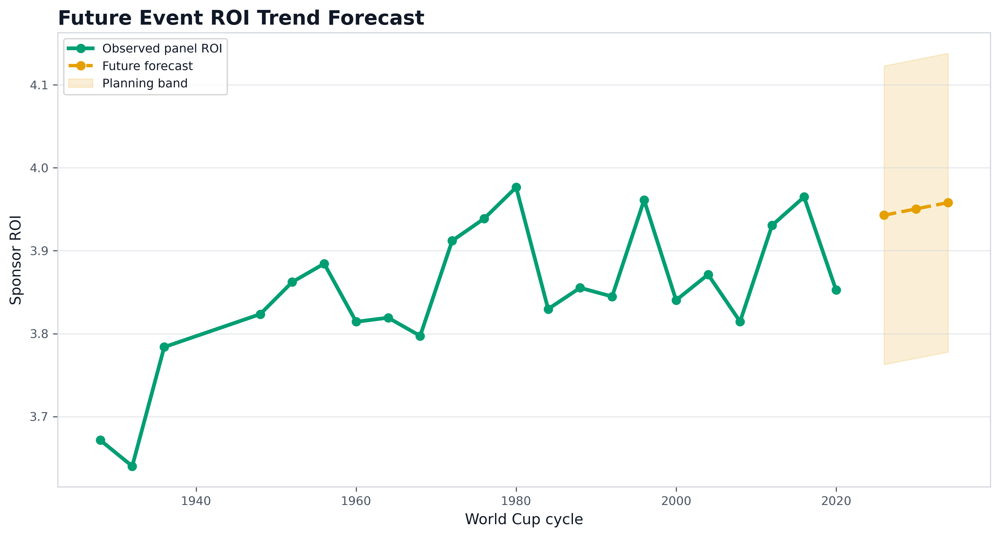
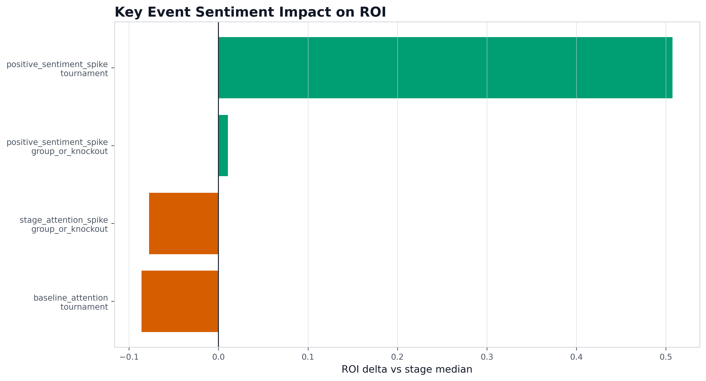
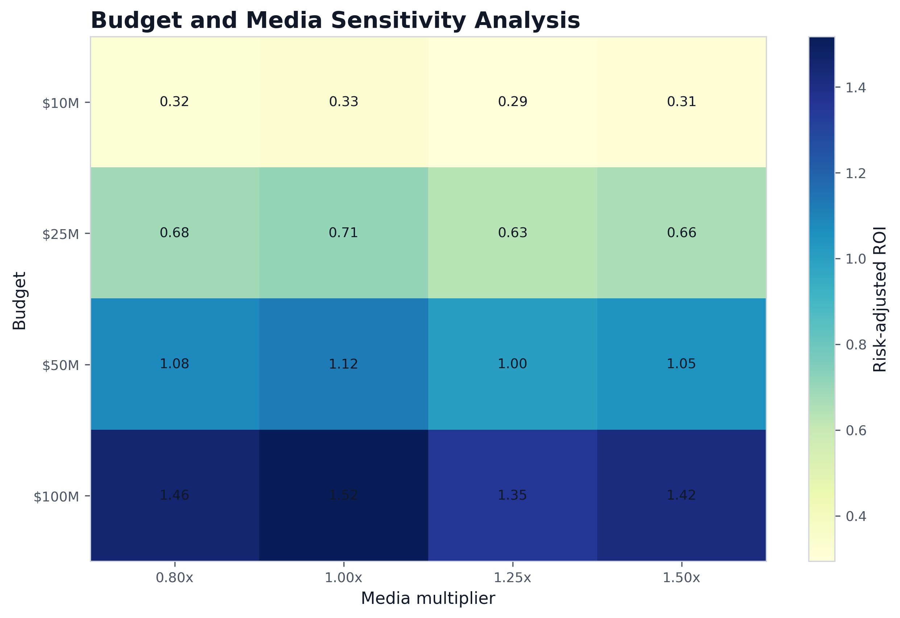
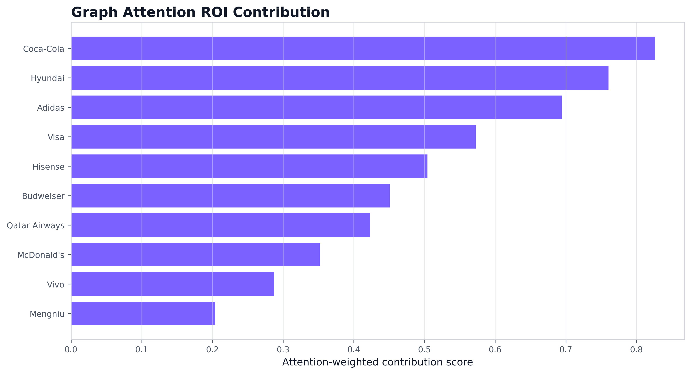
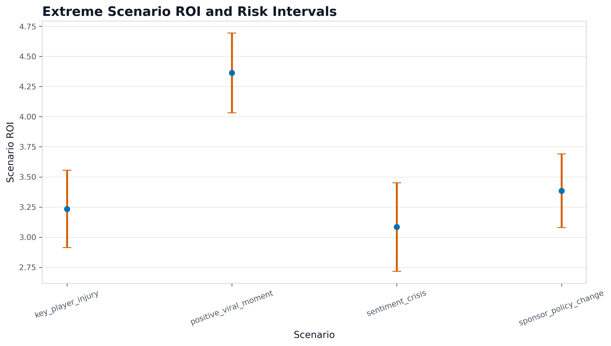
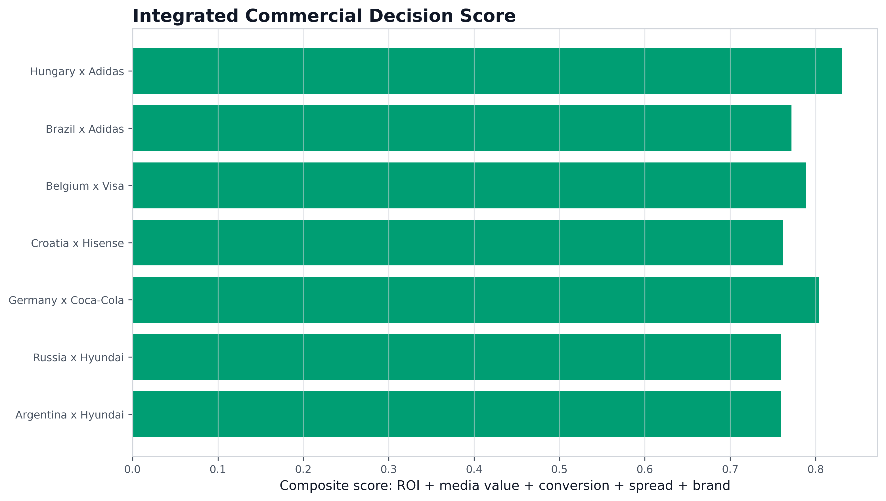

# Deep Analysis Figure Notes

## Future Event ROI Trend Forecast

**What it shows:** Shows historical cycle ROI and future cycle forecasts with a planning band.

**Why it matters:** It makes time dependence visible instead of treating every tournament as identical.

**Business takeaway:** Use as a budget planning prior for 2026/2030/2034 sponsorship cycles.

## Sentiment Event Impact on ROI

**What it shows:** Compares ROI deltas for positive, negative, and stage-driven attention events.

**Why it matters:** Sentiment shocks can change conversion quality even when exposure is high.

**Business takeaway:** Prepare contingency messaging and spend limits around high-attention negative events.

## Budget and Media Sensitivity

**What it shows:** Maps risk-adjusted ROI under budget and media multiplier combinations.

**Why it matters:** Optimization converts model output into a resource allocation recommendation.

**Business takeaway:** Scale spend where the sensitivity surface is high and stable.

## Graph Attention ROI Contribution

**What it shows:** Ranks sponsor nodes by graph attention-style contribution to ROI.

**Why it matters:** It explains relationship leverage beyond flat sponsor ranking.

**Business takeaway:** Use high-contribution sponsors as anchor nodes in portfolio planning.

## Extreme Scenario ROI and Risk Intervals

**What it shows:** Stress-tests key player injury, sentiment crisis, policy change, and viral upside.

**Why it matters:** Extreme cases reveal downside intervals that average ROI hides.

**Business takeaway:** Pre-approve response playbooks before the tournament starts.

## Integrated Commercial Decision Score

**What it shows:** Combines ROI, media value, fan conversion, social spread, and brand influence.

**Why it matters:** A sponsor decision is multi-objective; ROI alone is too narrow.

**Business takeaway:** Prioritize high composite score opportunities, then review risk intervals.
