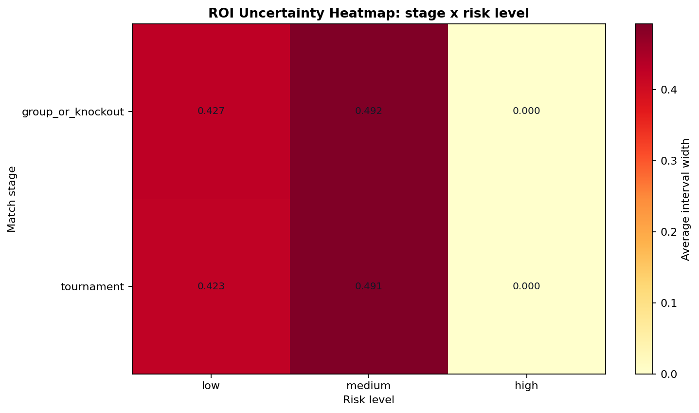
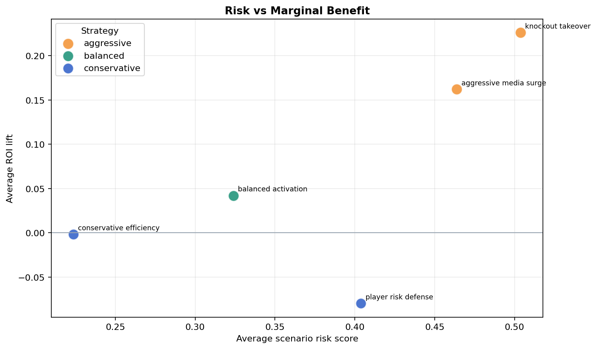

# Risk Visual Explanation

## uncertainty_heatmap.png

**What:** Average ROI interval width by match stage and risk level.

**Why:** Wider intervals indicate less certain sponsor ROI forecasts and should receive more analyst review before budget approval.

**Business Takeaway:** Use this heatmap as a budget-control layer. High-width cells should default to conservative or performance-based sponsor packages.

## risk_marginal_benefit.png

**What:** Scenario ROI lift plotted against average scenario risk.

**Why:** A high-lift strategy is not automatically better if its risk score grows faster than marginal benefit.

**Business Takeaway:** Favor strategies in the upper-left zone: positive lift with moderate risk. Aggressive strategies need a clear attention or stage premium reason.

## Highest Interval-Width Cases

| match_id | team_a | team_b | stage | risk_level | conformal_interval_width |
| --- | --- | --- | --- | --- | --- |
| 488 | Bulgaria | Greece | group_or_knockout | medium | 0.5550 |
| 513 | Bulgaria | Italy | group_or_knockout | medium | 0.5420 |
| 664 | Sweden | Paraguay | group_or_knockout | medium | 0.5400 |
| 360 | Italy | Germany | tournament | medium | 0.5370 |
| 204 | Israel | Uruguay | tournament | medium | 0.5370 |

## Strategy Risk Summary

| strategy_type | avg_roi_lift | avg_risk | avg_ci_width |
| --- | --- | --- | --- |
| aggressive | 0.1940 | 0.4840 | 0.6230 |
| balanced | 0.0420 | 0.3240 | 0.4670 |
| conservative | -0.0410 | 0.3140 | 0.4530 |